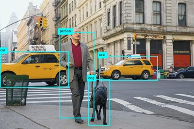

---
lab:
  title: 分析影像
  description: 使用 Azure AI 視覺影像分析來分析影像、建議標題和標籤，以及偵測物件和人員。
---

# 分析影像

Azure AI 視覺是一種人工智慧功能，可讓軟體系統藉由分析影像來解譯視覺輸入。 在 Microsoft Azure 中，「視覺」**** Azure AI 服務會提供常見電腦視覺工作的預先建置模型，包括分析影像以建議標題和標籤、偵測常見物件和人物。 您也可以使用 Azure AI 視覺服務來移除背景，或建立影像的前景嵌空。

> **注意**：本練習是以發行前 SDK 軟體為基礎，可能會有所變更。 如有必要，我們會使用特定版本的套件，這可能無法反映最新的可用版本。 您可能會遇到一些非預期行為、警告或錯誤。

雖然本練習是以 Azure 視覺 Python SDK 為基礎，您仍可使用多種特定語言 SDK 來開發 AI 聊天，包括：

* [適用於 JavaScript 的 Azure AI 視覺分析](https://www.npmjs.com/package/@azure-rest/ai-vision-image-analysis)
* [適用於 Microsoft .NET 的 Azure AI 視覺分析](https://www.nuget.org/packages/Azure.AI.Vision.ImageAnalysis)
* [適用於 Java 的 Azure AI 視覺分析](https://mvnrepository.com/artifact/com.azure/azure-ai-vision-imageanalysis)

本練習大約需要 **30** 分鐘的時間。

## 佈建 Azure AI 視覺資源

若您的訂閱中還沒有 Azure AI 視覺資源，則必須加以佈建。

> **注意**：在本練習中，您將使用獨立的**電腦視覺**資源。 您也可以直接 (或在 *Azure AI Foundry *專案中) 在 *Azure AI 服務*多服務資源中使用 Azure AI 視覺服務。

1. 在 `https://portal.azure.com` 開啟 [Azure 入口網站](https://portal.azure.com)，並使用您的 Azure 認證登入。 關閉任何顯示的歡迎訊息或秘訣。
1. 選取 [建立資源]****。
1. 在搜尋列中，搜尋 `Computer Vision`，選取 [電腦視覺]****，並使用下列設定建立資源：
    - **訂用帳戶**：您的 Azure 訂用帳戶**
    - **資源群組**：建立或選取資源群組**
    - **區域**：*從下列區域中選擇：**美國東部**、**美國西部**、**法國中部**、**南韓中部**、**北歐**、**東南亞**、**西歐**、或**東亞**\**
    - **名稱**：*電腦視覺資源的有效名稱*
    - **定價層**：免費 F0

    \*Azure AI 視覺 4.0 完整功能目前僅適用於這些區域。

1. 選取必要的核取方塊並建立資源。
1. 等候部署完成，然後檢視部署的詳細資料。
1. 部署資源後，請前往該資源，然後在瀏覽窗格中的 [資源管理]**** 節點下，檢視其 [金鑰和端點]**** 頁面。 在下一個程序中，您需要此頁面中的端點和其中一個金鑰。

## 使用 Azure AI 視覺 SDK 開發影像分析應用程式

在此練習中，您將完成部分實作的用戶端應用程式，其會使用 Azure AI 視覺 SDK 來分析影像。

### 準備應用程式組態

1. 使用 Azure 入口網站頂部搜尋列右側的 **[\>_]** 按鈕，以在 Azure 入口網站中建立一個新的 Cloud Shell，並選取訂閱中沒有儲存體的 ***PowerShell*** 環境。

    Cloud Shell 會在 Azure 入口網站底部的窗格顯示命令列介面。

    > **注意**：如果您之前建立了使用 *Bash* 環境的 Cloud Shell，請將其切換到 ***PowerShell***。

    > **注意**：若入口網站要求您選取儲存體來保存檔案，請選擇 [不需要儲存體帳戶]****，然後選取您正在使用的訂閱，然後按 [套用]****。

1. 在 Cloud Shell 工具列中，在**設定**功能表中，選擇**轉到經典版本**（這是使用程式碼編輯器所必需的）。

    **<font color="red">繼續之前，請先確定您已切換成 Cloud Shell 傳統版本。</font>**

1. 調整 Cloud Shell 窗格的大小，以便您可以看見電腦視覺資源的 [金鑰和端點]**** 頁面。

    > **秘訣**：您可以拖曳上方框線來調整窗格的大小。 您也可以使用最小化和最大化按鈕，在 Cloud Shell 和主要入口網站介面之間切換。

1. 請在 Cloud Shell 窗格中，輸入下列命令，以便複製包含練習程式碼檔案的 GitHub 存放庫（輸入 [命令]，或將它複製到剪貼簿，然後在命令列上點選滑鼠右鍵，再貼上純文字即可）：

    ```
    rm -r mslearn-ai-vision -f
    git clone https://github.com/MicrosoftLearning/mslearn-ai-vision
    ```

    > **秘訣**：當您將命令貼到 Cloud Shell 中時，輸出可能會佔用大量的螢幕緩衝區。 您可以透過輸入 `cls` 命令來清除螢幕，以便更輕鬆地專注於每個工作。

1. 複製存放庫之後，使用下列命令瀏覽並檢視包含應用程式程式碼檔案的資料夾：   

    ```
   cd mslearn-ai-vision/Labfiles/analyze-images/python/image-analysis
   ls -a -l
    ```

    資料夾包含應用程式的應用程式設定和程式碼檔案。 資料夾也包含 **/images** 子資料夾，其中包含一些供應用程式分析的影像檔。
    
1. 執行下列命令安裝 Azure AI 視覺 SDK 套件和其他必要套件：

    ```
   python -m venv labenv
   ./labenv/bin/Activate.ps1
   pip install -r requirements.txt azure-ai-vision-imageanalysis==1.0.0
    ```

1. 輸入下列命令，編輯應用程式的設定檔：

    ```
   code .env
    ```

    程式碼編輯器中會開啟檔案。

1. 在程式碼檔案中，更新其包含的設定值，以反映**端點**和電腦視覺資源的驗證**金鑰** (從 Azure 入口網站中的 [金鑰和端點]**** 頁面複製)。
1. 取代預留位置後，使用 **CTRL+S** 命令儲存變更，然後使用 **CTRL+Q** 命令關閉程式碼編輯器，同時保持 Cloud Shell 命令列開啟。

### 新增程式碼以建議標題

1. 在 Cloud Shell 命令列中，輸入下列命令以開啟用戶端應用程式的程式碼檔案：

    ```
   code image-analysis.py
    ```

    > **秘訣**：建議您最大化 Cloud Shell 窗格，並在命令列主控台與程式碼編輯器之間移動分割列，以便更輕鬆地查看程式碼。

1. 在程式碼檔案中，尋找 **Import namespaces** 註解，並在註解下方新增下列程式碼，以匯入您使用 Azure AI 視覺 SDK 所需的命名空間：

    ```python
   # import namespaces
   from azure.ai.vision.imageanalysis import ImageAnalysisClient
   from azure.ai.vision.imageanalysis.models import VisualFeatures
   from azure.core.credentials import AzureKeyCredential
    ```

1. 在 **Main** 函式中，您會發現已提供可載入組態設定並決定待分析影像檔的程式碼。 然後尋找 **Authenticate Azure AI Vision client** 註解，並新增下列程式碼來建立和驗證 Azure AI 視覺用戶端物件 (請務必維持正確的縮排層級)：

    ```python
   # Authenticate Azure AI Vision client
   cv_client = ImageAnalysisClient(
        endpoint=ai_endpoint,
        credential=AzureKeyCredential(ai_key))
    ```

1. 在 **Main** 函式中，剛才新增的程式碼下方，尋找 **Analyze image** 註解並新增下列程式碼：

    ```python
   # Analyze image
   with open(image_file, "rb") as f:
        image_data = f.read()
   print(f'\nAnalyzing {image_file}\n')

   result = cv_client.analyze(
        image_data=image_data,
        visual_features=[
            VisualFeatures.CAPTION,
            VisualFeatures.DENSE_CAPTIONS,
            VisualFeatures.TAGS,
            VisualFeatures.OBJECTS,
            VisualFeatures.PEOPLE],
   )
    ```

1. 尋找 **Get image captions** 註解，新增下列程式碼以顯示影像標題和密集標題：

    ```python
   # Get image captions
   if result.caption is not None:
        print("\nCaption:")
        print(" Caption: '{}' (confidence: {:.2f}%)".format(result.caption.text, result.caption.confidence * 100))
    
   if result.dense_captions is not None:
        print("\nDense Captions:")
        for caption in result.dense_captions.list:
            print(" Caption: '{}' (confidence: {:.2f}%)".format(caption.text, caption.confidence * 100))
    ```

1. 儲存變更 (*CTRL+S*) 並調整窗格大小，以便您可以清楚看到命令列主控台，同時保持程式碼編輯器開啟。 然後輸入下列命令，以使用引數 **images/street.jpg** 執行程式：

    ```
   python image-analysis.py images/street.jpg
    ```

1. 觀察輸出，其中應該包含 **street.jpg** 影像的建議標題，如下所示：

    

1. 再次執行程式，這次使用引數 **images/building.jpg** 來查看為 **building.jpg** 影像產生的標題，如下所示：

    

1. 重複上一個步驟以產生 **images/person.jpg** 檔案的標題，如下所示：

    

### 新增程式碼以產生建議的標籤

有時候，識別提供影像內容線索的相關*標籤*可能很有用。

1. 在程式編輯器的 **AnalyzeImage** 函式中，尋找 **Get image tags** 註解，並新增下列程式碼：

    ```python
   # Get image tags
   if result.tags is not None:
        print("\nTags:")
        for tag in result.tags.list:
            print(" Tag: '{}' (confidence: {:.2f}%)".format(tag.name, tag.confidence * 100))
    ```

1. 儲存變更 (*CTRL+S*) 並使用引數 **images/street.jpg** 執行程式，觀察除了影像標題之外，還顯示建議標籤清單。
1. 重新執行 **images/building.jpg** 和 **images/person.jpg** 檔案的程式。

### 新增程式碼以偵測和尋找物件

1. 在程式碼編輯器的 **AnalyzeImage **函式中，尋找 **Get objects in the image** 註解，並新增下列程式碼以列出影像中偵測到的物件，然後呼叫提供的函式，以在影像上標註偵測到的物件：

    ```python
   # Get objects in the image
   if result.objects is not None:
        print("\nObjects in image:")
        for detected_object in result.objects.list:
            # Print object tag and confidence
            print(" {} (confidence: {:.2f}%)".format(detected_object.tags[0].name, detected_object.tags[0].confidence * 100))
        # Annotate objects in the image
        show_objects(image_file, result.objects.list)
    ```

1. 儲存變更 (*CTRL+S*) 並使用引數 **images/street.jpg** 執行程式，觀察除了影像標題和建議標籤之外，還產生了名為 **objects.jpg** 的檔案。
1. 使用 (特定 Azure Cloud Shell) **download** 命令來下載 **objects.jpg** 檔案：

    ```
   download objects.jpg
    ```

    下載命令就會在瀏覽器右下方建立快顯視窗連結，您可以選取連結，即可下載並開啟檔案。 該影像看起來應類似如下：

    

1. 重新執行 **images/building.jpg** 和 **images/person.jpg** 檔案的程式，並在每次執行後下載產生的 objects.jpg 檔案。

### 新增程式碼以偵測並找出人員

1. 在程式碼編輯器的 **AnalyzeImage** 函式中，尋找 **Get people in the image** 註解，並新增下列程式碼，以列出所偵測到任何信賴等級為 20% 或更高的人員，並呼叫提供的函式，以在影像中標註他們：

    ```Python
   # Get people in the image
   if result.people is not None:
        print("\nPeople in image:")

        for detected_person in result.people.list:
            if detected_person.confidence > 0.2:
                # Print location and confidence of each person detected
                print(" {} (confidence: {:.2f}%)".format(detected_person.bounding_box, detected_person.confidence * 100))
        # Annotate people in the image
        show_people(image_file, result.people.list)
    ```

1. 儲存變更 (*CTRL+S*) 並使用引數 **images/street.jpg** 執行程式，觀察除了影像標題、建議標籤和 objects.jpg 檔案之外，還產生了人員位置清單和名為 **people.jpg** 的檔案。

1. 使用 (特定 Azure Cloud Shell) **download** 命令來下載 **objects.jpg** 檔案：

    ```
   download people.jpg
    ```

    下載命令就會在瀏覽器右下方建立快顯視窗連結，您可以選取連結，即可下載並開啟檔案。 該影像看起來應類似如下：

    

1. 重新執行 **images/building.jpg** 和 **images/person.jpg** 檔案的程式，並在每次執行後下載產生的 people.jpg 檔案。

   > **提示：** 若您看到模型傳回的邊界方塊不具意義，請檢查 JSON 信賴度分數，並嘗試增加應用程式中的信賴度分數篩選。

## 清除資源

若您已完成探索 Azure AI 視覺，您應該刪除在本練習中建立的資源，以避免產生不必要的 Azure 成本：

1. 開啟 Azure 入口網站 (位於 `https://portal.azure.com`)，使用與您的 Azure 訂用帳戶相關聯的 Microsoft 帳戶進行登入。

1. 在頂端搜尋列中，搜尋 [電腦視覺]**，然後選取您在此實驗室中建立的電腦視覺資源。

1. 在資源頁面上選取 [刪除]****，然後依照指示刪除資源。

