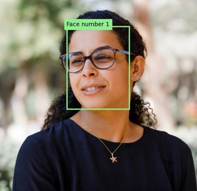

---
lab:
  title: 偵測並分析臉部
  description: 使用 Azure AI 視覺臉部服務來實作臉部偵測和分析解決方案。
---

# 偵測並分析臉部

偵測並分析人臉的能力，是核心 AI 功能。 在本練習中，您將探索**臉部**服務並處理臉部。

> **注意**：本練習是以發行前 SDK 軟體為基礎，可能會有所變更。 如有必要，我們會使用特定版本的套件，這可能無法反映最新的可用版本。 您可能會遇到一些非預期行為、警告或錯誤。

雖然本練習是以 Azure 視覺臉部 Python SDK 為基礎，您仍可使用多種特定語言 SDK 來開發 AI 聊天，包括：

* [適用於 JavaScript 的 Azure AI 視覺臉部](https://www.npmjs.com/package/@azure-rest/ai-vision-face)
* [適用於 Microsoft .NET 的 Azure AI 視覺臉部](https://www.nuget.org/packages/Azure.AI.Vision.Face)
* [適用於 Java 的 Azure AI 視覺臉部](https://central.sonatype.com/artifact/com.azure/azure-ai-vision-face)

本練習大約需要 **30** 分鐘的時間。

> **注意**：傳回個人識別資訊的 Azure AI 服務功能僅限已授與[有限存取權](https://learn.microsoft.com/legal/cognitive-services/computer-vision/limited-access-identity)的客戶使用。 此練習不包括臉部辨識工作，無需要求任何額外針對受限功能的存取權即可完成。

## 佈建 Azure AI 臉部 API 資源

若您的訂閱中還沒有 Azure AI 臉部 API 資源，則必須加以佈建。

> **注意**：在本練習中，您將使用獨立的**臉部**資源。 您也可以直接 (或在 *Azure AI Foundry *專案中) 在 *Azure AI 服務*多服務資源中使用 Azure AI 臉部服務。

1. 在 `https://portal.azure.com` 開啟 [Azure 入口網站](https://portal.azure.com)，並使用您的 Azure 認證登入。 關閉任何顯示的歡迎訊息或秘訣。
1. 選取 [建立資源]****。
1. 在搜尋列中，搜尋 `Face`，選取 [臉部]****，並使用下列設定建立資源：
    - **訂用帳戶**：您的 Azure 訂用帳戶**
    - **資源群組**：建立或選取資源群組**
    - **區域**：*選擇任何可用的區域*
    - **名稱**：*臉部資源的有效名稱*
    - **定價層**：免費 F0

1. 建立資源並等候部署完成，然後檢視部署詳細資料。
1. 部署資源後，請前往該資源，然後在瀏覽窗格中的 [資源管理]**** 節點下，檢視其 [金鑰和端點]**** 頁面。 在下一個程序中，您需要此頁面中的端點和其中一個金鑰。

## 使用臉部 SDK 開發臉部分析應用程式

在本練習中，您將完成已部分實作、使用 Azure 臉部 SDK 對影像中的人臉進行偵測和分析的用戶端應用程式。

### 準備應用程式組態

1. 使用 Azure 入口網站頂部搜尋列右側的 **[\>_]** 按鈕，以在 Azure 入口網站中建立一個新的 Cloud Shell，並選取訂閱中沒有儲存體的 ***PowerShell*** 環境。

    Cloud Shell 會在 Azure 入口網站底部的窗格顯示命令列介面。

    > **注意**：如果您之前建立了使用 *Bash* 環境的 Cloud Shell，請將其切換到 ***PowerShell***。

    > **注意**：若入口網站要求您選取儲存體來保存檔案，請選擇 [不需要儲存體帳戶]****，然後選取您正在使用的訂閱，然後按 [套用]****。

1. 在 Cloud Shell 工具列中，在**設定**功能表中，選擇**轉到經典版本**（這是使用程式碼編輯器所必需的）。

    **<font color="red">繼續之前，請先確定您已切換成 Cloud Shell 傳統版本。</font>**

1. 調整 Cloud Shell 窗格的大小，以便您可以看見臉部資源的 [金鑰和端點]**** 頁面。

    > **秘訣**：您可以拖曳上方框線來調整窗格的大小。 您也可以使用最小化和最大化按鈕，在 Cloud Shell 和主要入口網站介面之間切換。

1. 請在 Cloud Shell 窗格中，輸入下列命令，以便複製包含練習程式碼檔案的 GitHub 存放庫（輸入 [命令]，或將它複製到剪貼簿，然後在命令列上點選滑鼠右鍵，再貼上純文字即可）：

    ```
    rm -r mslearn-ai-vision -f
    git clone https://github.com/MicrosoftLearning/mslearn-ai-vision
    ```

    > **秘訣**：當您將命令貼到 Cloud Shell 中時，輸出可能會佔用大量的螢幕緩衝區。 您可以透過輸入 `cls` 命令來清除螢幕，以便更輕鬆地專注於每個工作。

1. 複製存放庫之後，使用下列命令瀏覽至應用程式程式碼檔案：

    ```
   cd mslearn-ai-vision/Labfiles/face/python/face-api
   ls -a -l
    ```

    資料夾包含應用程式的應用程式設定和程式碼檔案。 資料夾也包含 **/images** 子資料夾，其中包含一些供應用程式分析的影像檔。

1. 執行下列命令安裝 Azure AI 視覺 SDK 套件和其他必要套件：

    ```
   python -m venv labenv
   ./labenv/bin/Activate.ps1
   pip install -r requirements.txt azure-ai-vision-face==1.0.0b2
    ```

1. 輸入下列命令，編輯應用程式的設定檔：

    ```
   code .env
    ```

    程式碼編輯器中會開啟檔案。

1. 在程式碼檔案中，更新其包含的設定值，以反映**端點**和臉部資源的驗證**金鑰** (從 Azure 入口網站中的 [金鑰和端點]**** 頁面複製)。
1. 取代預留位置後，使用 **CTRL+S** 命令儲存變更，然後使用 **CTRL+Q** 命令關閉程式碼編輯器，同時保持 Cloud Shell 命令列開啟。

### 新增程式碼以建立臉部 API 用戶端

1. 在 Cloud Shell 命令列中，輸入下列命令以開啟用戶端應用程式的程式碼檔案：

    ```
   code analyze-faces.py
    ```

    > **秘訣**：建議您最大化 Cloud Shell 窗格，並在命令列主控台與程式碼編輯器之間移動分割列，以便更輕鬆地查看程式碼。

1. 在程式碼檔案中，尋找 **Import namespaces** 註解，並在註解下方新增下列程式碼，以匯入您使用 Azure AI 視覺 SDK 所需的命名空間：

    ```python
   # Import namespaces
   from azure.ai.vision.face import FaceClient
   from azure.ai.vision.face.models import FaceDetectionModel, FaceRecognitionModel, FaceAttributeTypeDetection01
   from azure.core.credentials import AzureKeyCredential
    ```

1. 在 **Main** 函式中，您會發現已提供可載入組態設定並決定待分析影像的程式碼。 然後尋找 **Authenticate Face client** 註解，並新增以下程式碼來建立和驗證 **FaceClient** 物件：

    ```python
   # Authenticate Face client
   face_client = FaceClient(
        endpoint=cog_endpoint,
        credential=AzureKeyCredential(cog_key))
    ```

### 新增程式碼以偵測及分析臉部

1. 在應用程式程式碼檔案的 **Main** 函式中，尋找 **Specify facial features to be retrieved** 註解，然後新增下列程式碼：

    ```python
   # Specify facial features to be retrieved
   features = [FaceAttributeTypeDetection01.HEAD_POSE,
                FaceAttributeTypeDetection01.OCCLUSION,
                FaceAttributeTypeDetection01.ACCESSORIES]
    ```

1. 在 **Main** 函數中，在您剛剛新增的程式碼下，找到 **Get faces** 註解並新增以下程式碼來列印臉部特徵資訊，並呼叫一個函式，該函式使用每個偵測到的人臉的週框方塊來標註影像 (根據每個臉部的 **face_rectangle** 屬性)：

    ```Python
   # Get faces
   with open(image_file, mode="rb") as image_data:
        detected_faces = face_client.detect(
            image_content=image_data.read(),
            detection_model=FaceDetectionModel.DETECTION01,
            recognition_model=FaceRecognitionModel.RECOGNITION01,
            return_face_id=False,
            return_face_attributes=features,
        )

   face_count = 0
   if len(detected_faces) > 0:
        print(len(detected_faces), 'faces detected.')
        for face in detected_faces:
    
            # Get face properties
            face_count += 1
            print('\nFace number {}'.format(face_count))
            print(' - Head Pose (Yaw): {}'.format(face.face_attributes.head_pose.yaw))
            print(' - Head Pose (Pitch): {}'.format(face.face_attributes.head_pose.pitch))
            print(' - Head Pose (Roll): {}'.format(face.face_attributes.head_pose.roll))
            print(' - Forehead occluded?: {}'.format(face.face_attributes.occlusion["foreheadOccluded"]))
            print(' - Eye occluded?: {}'.format(face.face_attributes.occlusion["eyeOccluded"]))
            print(' - Mouth occluded?: {}'.format(face.face_attributes.occlusion["mouthOccluded"]))
            print(' - Accessories:')
            for accessory in face.face_attributes.accessories:
                print('   - {}'.format(accessory.type))
            # Annotate faces in the image
            annotate_faces(image_file, detected_faces)
    ```

1. 檢查您新增至 **Main** 函式的程式碼。 該程式碼會分析影像檔，並偵測其所包含的任何臉部，包括頭部姿勢、遮蔽情況和眼鏡等配件的屬性。 此外，還會呼叫一個函數，為每個偵測到的臉部使用週框方塊來標註原始影像。
1. 儲存您的變更 (*CTRL+S*)，但請維持開啟程式碼編輯器，以防您需要修正任何拼字錯誤。

1. 調整窗格大小，以便看到更多主控台，然後輸入下列命令，以使用引數 *images/face1.jpg* 執行程式：

    ```
   python analyze-faces.py images/face1.jpg
    ```

    應用程式會執行並分析下列影像：

    

1. 觀察輸出，其中應該包含偵測到的每個臉部的識別碼和屬性。 
1. 您會發現同時也產生了名為 **detected_faces.jpg** 的影像檔。 使用 (特定 Azure Cloud Shell) **download** 命令以下載：

    ```
   download detected_faces.jpg
    ```

    下載命令就會在瀏覽器右下方建立快顯視窗連結，您可以選取連結，即可下載並開啟檔案。 影像看起來應該會像這樣：

    

1. 再次執行程式，這次指定參數 *images/face2.jpg* 以從下列影像中擷取文字：

    

    ```
   python analyze-faces.py images/face2.jpg
    ```

1. 下載並檢視產生的 **detected_faces.jpg** 檔案：

    ```
   download detected_faces.jpg
    ```

    產生的影像應該如下所示：

    

1. 再執行程式一次，這次指定參數 *images/faces.jpg* 以從此影像中擷取文字：

    

    ```
   python analyze-faces.py images/faces.jpg
    ```

1. 下載並檢視產生的 **detected_faces.jpg** 檔案：

    ```
   download detected_faces.jpg
    ```

    產生的影像應該如下所示：

    

## 清除資源

若您已完成探索 Azure AI 視覺，您應該刪除在本練習中建立的資源，以避免產生不必要的 Azure 成本：

1. 開啟 Azure 入口網站 (位於 `https://portal.azure.com`)，然後在頂端搜尋列中搜尋您在此實驗中所建立的資源。

1. 在資源頁面上，選取 [刪除]**** 並依照指示刪除該資源。 或者，您也可以刪除整個資源群組以同時清理所有資源。
