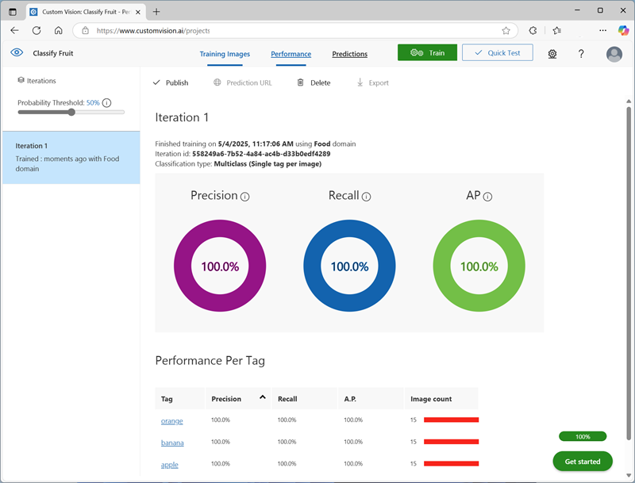

---
lab:
  title: 分類影像
  description: 使用 Azure AI 自訂視覺服務來訓練影像分類模型。
---

# 分類影像

**Azure AI 自訂視覺**服務可讓您建立以自己的影像定型的電腦視覺模型。 您可用來定型*影像分類*和*物件偵測*模型；然後可從應用程式進行發佈和取用。

在此練習中，您將使用自訂視覺服務來定型可識別三種水果 (蘋果、香蕉和柳橙) 的影像分類模型。

雖然本練習是以 Azure 自訂視覺 Python SDK 為基礎，您仍可使用多種特定語言 SDK 來開發 AI 聊天，包括：

* [適用於 JavaScript 的 Azure 自訂視覺 (訓練)](https://www.npmjs.com/package/@azure/cognitiveservices-customvision-training)
* [適用於 JavaScript 的 Azure 自訂視覺 (預測)](https://www.npmjs.com/package/@azure/cognitiveservices-customvision-prediction)
* [適用於 Microsoft .NET 的 Azure 自訂視覺 (訓練)](https://www.nuget.org/packages/Microsoft.Azure.CognitiveServices.Vision.CustomVision.Training/)
* [適用於 .NET 的 Azure 自訂視覺 Microsoft (預測)](https://www.nuget.org/packages/Microsoft.Azure.CognitiveServices.Vision.CustomVision.Prediction/)
* [適用於 Java 的 Azure 自訂視覺 (訓練)](https://search.maven.org/artifact/com.azure/azure-cognitiveservices-customvision-training/1.1.0-preview.2/jar)
* [適用於 Java 的 Azure 自訂視覺 (預測)](https://search.maven.org/artifact/com.azure/azure-cognitiveservices-customvision-prediction/1.1.0-preview.2/jar)

此練習大約需要 **45 分鐘**。

## 建立自訂視覺資源

在定型模型之前，您需要 Azure 資源進行*定型*和*預測*。 您可以為每項工作建立**自訂視覺**資源，也可以建立單一資源並同時用於兩者。 在本練習中，您將建立用於訓練和預測的**自訂視覺**資源。

1. 在 `https://portal.azure.com` 開啟 [Azure 入口網站](https://portal.azure.com)，並使用您的 Azure 認證登入。 關閉任何顯示的歡迎訊息或秘訣。
1. 選取 [建立資源]****。
1. 在搜尋列中，搜尋 `Custom Vision`，選取 [自訂視覺]****，並使用下列設定建立資源：
    - **建立選項**：兩者
    - **訂用帳戶**：您的 Azure 訂用帳戶**
    - **資源群組**：建立或選取資源群組**
    - **區域**：*選擇任何可用的區域*
    - **名稱**：*自訂視覺資源的有效名稱*
    - **定型定價層**：F0
    - **預測定價層**：F0

1. 建立資源並等候部署完成，然後檢視部署詳細資料。 您會發現有兩個自訂視覺資源已佈建，一個用於訓練，另一個用於預測。

    > **注意**：每個資源都有自己的*端點*和*金鑰*，可用來管理來自程式碼的存取。 若要定型影像分類模型，您的程式碼必須使用*定型*資源 (搭配其端點和金鑰)；而若要使用定型的模型來預測影像類別，您的程式碼必須使用*預測*資源 (搭配其端點和金鑰)。

1. 部署資源之後，請前往資源群組檢視。 您應該會看到兩個自訂視覺資源，其中一個有著尾碼 ***-Prediction***。

## 在自訂視覺入口網站中建立自訂視覺專案

若要定型影像分類模型，您需要根據定型資源建立自訂視覺專案。 為此，您將使用自訂視覺入口網站。

1. 開啟新的瀏覽器索引標籤 (將 Azure 入口網站索引標籤保持開啟，您會在稍後返回)。
1. 在瀏覽器索引標籤中，開啟位於 `https://customvision.ai` 的[自訂視覺入口網站](https://customvision.ai)。 若出現提示，請使用您的 Azure 認證登入，並同意服務條款。
1. 在自訂視覺入口網站中，使用下列設定建立新的專案：
    - **名稱**：`Classify Fruit`
    - **描述**：`Image classification for fruit`
    - **資源**：*您的自訂視覺資源*
    - **專案類型**：分類
    - **分類類型**：多類別 (每一影像一個標籤)
    - **領域**：食物

### 上傳並標記影像

1. 在新的瀏覽器索引標籤中，從 `https://github.com/MicrosoftLearning/mslearn-ai-vision/raw/main/Labfiles/image-classification/training-images.zip` 下載[訓練影像](https://github.com/MicrosoftLearning/mslearn-ai-vision/raw/main/Labfiles/image-classification/training-images.zip)，並擷取 zip 資料夾以檢視其內容。 此資料夾包含蘋果、香蕉和柳橙影像的子資料夾。
1. 在自訂視覺入口網站的影像分類專案中，按一下 [新增影像]****，然後選取您先前下載並解壓縮的 **training-images/apple** 資料夾中的所有檔案。 然後上傳影像檔，並指定 `apple` 標籤，如下所示：

    

1. 使用 [新增影像]**** (**[+]**) 工具列圖示以重複上一個步驟，然後上傳 **banana** 資料夾中的影像並加上標籤 `banana`，以及上傳 **orange** 資料夾中的影像並加上標籤 `orange`。
1. 探索您在自訂視覺專案中上傳的影像 - 每個類別應該會有 15 個影像，如下所示：

    

### 將模型定型

1. 在自訂視覺專案中，於影像上方按一下 [訓練]**** (&#9881;<sub>&#9881;</sub>) 以使用已加上標籤的影像來訓練分類模型。 選取 [快速定型]**** 選項，然後等候定型反覆項目完成 (這可能需要一分鐘左右的時間)。
1. 當模型反覆項目已完成定型時，請檢閱*精確度*、*重新叫用率*和 *AP* 效能計量 - 這些計量會測量分類模型的預測精確度，而且值應該都很高。

    

> **注意**：效能計量是以每個預測的機率閾值 50% 為基礎 (換句話說，如果模型計算影像屬於特定類別的機率為 50% 或更高，則會預測該類別)。 您可以在頁面左上方調整此值。

### 測試模型

1. 在效能計量上方，按一下 [快速測試]****。
1. 在 [影像 URL]**** 方塊，輸入 `https://aka.ms/test-apple` 並按一下 [快速測試影像 (➔)]** 按鈕。
1. 檢視模型傳回的預測 - *apple* 的可能性分數應該會最高，如下所示：

    

1. 請嘗試測試下列影像：
    - `https://aka.ms/test-banana`
    - `https://aka.ms/test-orange`

1. 關閉 [快速測試]**** 視窗。

### 檢視專案設定

您建立的專案已獲得唯一的識別碼，您必須在與其互動的任何程式碼中指定該識別碼。

1. 按一下 [效能]**** 頁面右上方的設定** (&#9881;) 圖示，以檢視專案設定。
1. 在左側的 [一般]**** 之下，記下可唯一識別此專案的 [專案識別碼]****。
1. 在右側的 [資源]**** 之下，注意已顯示金鑰和端點。 這些是*定型*資源的詳細資料 (您也可以在 Azure 入口網站中檢視資源以取得這項資訊)。

## 使用*定型* API

自訂視覺入口網站提供方便的使用者介面，可供您上傳和標記影像，以及定型模型。 不過，在某些情況下，您可能想要使用自訂視覺定型 API 將模型定型自動化。

### 準備應用程式組態

1. 返回包含 Azure 入口網站的瀏覽器索引標籤 (將自訂視覺入口網站索引標籤保持開啟，您會在稍後返回)。
1. 使用 Azure 入口網站頂部搜尋列右側的 **[\>_]** 按鈕，以在 Azure 入口網站中建立一個新的 Cloud Shell，並選取訂閱中沒有儲存體的 ***PowerShell*** 環境。

    Cloud Shell 會在 Azure 入口網站底部的窗格顯示命令列介面。

    > **注意**：如果您之前建立了使用 *Bash* 環境的 Cloud Shell，請將其切換到 ***PowerShell***。

    > **注意**：若入口網站要求您選取儲存體來保存檔案，請選擇 [不需要儲存體帳戶]****，然後選取您正在使用的訂閱，然後按 [套用]****。

1. 在 Cloud Shell 工具列中，在**設定**功能表中，選擇**轉到經典版本**（這是使用程式碼編輯器所必需的）。

    **<font color="red">繼續之前，請先確定您已切換成 Cloud Shell 傳統版本。</font>**

1. 調整 Cloud Shell 窗格大小以查看更多內容。

    > **秘訣**：您可以拖曳上方框線來調整窗格的大小。 您也可以使用最小化和最大化按鈕，在 Cloud Shell 和主要入口網站介面之間切換。

1. 請在 Cloud Shell 窗格中，輸入下列命令，以便複製包含練習程式碼檔案的 GitHub 存放庫（輸入 [命令]，或將它複製到剪貼簿，然後在命令列上點選滑鼠右鍵，再貼上純文字即可）：

    ```
    rm -r mslearn-ai-vision -f
    git clone https://github.com/MicrosoftLearning/mslearn-ai-vision
    ```

    > **提示**：當您將命令貼到 Cloud Shell 中時，輸出可能會佔用大量的螢幕緩衝區。 您可以透過輸入 `cls` 命令來清除螢幕，以便更輕鬆地專注於每個工作。

1. 複製存放庫之後，使用下列命令瀏覽至應用程式程式碼檔案：

    ```
   cd mslearn-ai-vision/Labfiles/image-classification/python/train-classifier
   ls -a -l
    ```

    資料夾包含應用程式的應用程式設定和程式碼檔案。 資料夾也包含 **/more-training-images** 子資料夾，其中包含您將用來執行模型額外訓練的一些影像檔。

1. 執行下列命令，安裝 Azure AI 自訂視覺 SDK 套件以進行訓練，並安裝任何其他必要套件：

    ```
   python -m venv labenv
   ./labenv/bin/Activate.ps1
   pip install -r requirements.txt azure-cognitiveservices-vision-customvision
    ```

1. 輸入下列命令，編輯應用程式的設定檔：

    ```
   code .env
    ```

    程式碼編輯器中會開啟檔案。

1. 在程式碼檔案中，更新其中包含的設定值，以反映自訂視覺*訓練*資源的**端點**和驗證**金鑰**，以及您先前建立的自訂視覺專案的**專案識別碼**。
1. 取代預留位置後，在程式碼編輯器中使用 **CTRL+S** 命令儲存變更，然後使用 **CTRL+Q** 命令關閉程式碼編輯器，同時保持 Cloud Shell 命令列開啟。

### 撰寫程式碼以執行模型訓練

1. 在 Cloud Shell 命令列中，輸入下列命令以開啟用戶端應用程式的程式碼檔案：

    ```
   code train-classifier.py
    ```

1. 您會發現程式碼檔案中的下列詳細資料：
    - 已匯入 Azure AI 自訂視覺 SDK 的命名空間。
    - **Main** 函式會擷取組態設定，並使用金鑰和端點來建立已驗證。
    - **CustomVisionTrainingClient**，接著會與專案識別碼搭配使用，建立專案的 **Project** 參考。
    - **Upload_Images** 函式會擷取自訂視覺專案中定義的標記，然後將影像檔案從對應命名的資料夾上傳至專案，並指派適當的標記識別碼。
    - **Train_Model** 函式會為專案建立新的定型反覆運算，並等候定型完成。

1. 關閉程式碼編輯器 (*CTRL+Q*)，然後輸入下列命令以執行程式：

    ```
   python train-classifier.py
    ```

1. 等候程式結束。 然後返回包含自訂視覺入口網站的瀏覽器索引標籤，並檢視專案的 [訓練影像]**** 頁面 (視需要重新整理瀏覽器)。
1. 確認已將一些已標記的新影像新增至專案。 然後檢視 [效能]**** 頁面，並確認已建立新的反覆運算。

## 在用戶端應用程式中使用影像分類器

現在，您已準備好發佈已訓練的模型，並在用戶端應用程式中使用。

### 發佈影像分類模型

1. 在自訂視覺入口網站的 [效能]**** 頁面上，按一下 [&#128504; 發佈]**** 以發佈具有下列設定的已定型模型：
    - **模型名稱**：`fruit-classifier`
    - **預測資源**：*您先前建立的**預測**資源，其結尾是 "-Prediction" (<u>不是</u>定型資源)*。
1. 在 [專案設定] **** 頁面的左上方，按一下*專案資源庫* (&#128065;) 圖示以返回自訂視覺入口網站首頁，現在您的專案已在其中列出。
1. 在自訂視覺入口網站首頁的右上方，按一下設定 ** (&#9881;) 圖示以檢視自訂視覺服務的設定。 然後，在 [資源]**** 之下，尋找以 "-Prediction" 結尾的*預測*資源 (<u>不是</u>定型資源) 來判斷其**金鑰**和**端點**值 (您也可在Azure 入口網站中檢視資源以取得這項資訊)。

### 從用戶端應用程式使用影像分類器

1. 返回包含 Azure 入口網站和 Cloud Shell 的瀏覽器索引標籤。
1. 在 Cloud Shell 中，執行下列命令以切換至用戶端應用程式的資料夾，並檢視其所包含的檔案：

    ```
   cd ../test-classifier
   ls -a -l
    ```

    資料夾包含應用程式的應用程式設定和程式碼檔案。 資料夾也包含 **/test-images** 子資料夾，其中包含您將用來測試模型的一些影像檔。

1. 執行下列命令，安裝 Azure AI 自訂視覺 SDK 套件以進行預測，並安裝任何其他必要套件：

    ```
   python -m venv labenv
   ./labenv/bin/Activate.ps1
   pip install -r requirements.txt azure-cognitiveservices-vision-customvision
    ```

1. 輸入下列命令，編輯應用程式的設定檔：

    ```
   code .env
    ```

    程式碼編輯器中會開啟檔案。

1. 更新設定值，以反映自訂視覺*<u>預測</u>* 資源的**端點**和**金鑰**、分類專案的**專案識別碼**，以及已發佈模型的名稱 (應為 *fruit-classifier*)。 儲存變更 (*CTRL+S*)，然後關閉程式碼編輯器 (*CTRL+Q*)。
1. 在 Cloud Shell 命令列中，輸入下列命令以開啟用戶端應用程式的程式碼檔案：

    ```
   code test-classifier.py
    ```

1. 檢閱程式碼，並注意下列詳細資料：
    - 已匯入 Azure AI 自訂視覺 SDK 的命名空間。
    - **Main** 函式會擷取組態設定，並使用金鑰和端點來建立已驗證的 **CustomVisionPredictionClient**。
    - 預測用戶端物件用於預測 **test-images** 資料夾中每個影像的類別，並為每個要求指定專案識別碼和模型名稱。 每個預測都包含每個可能類別的機率，且只會顯示機率大於 50% 的預測標記。

1. 關閉程式碼編輯器，然後輸入下列命令以執行程式：

    ```
   python test-classifier.py
    ```

    程式會將下列每個影像提交至模型進行分類：

    

    **IMG_TEST_1.jpg**

    <br/><br/>

    

    **IMG_TEST_2.jpg**

    <br/><br/>

    

    **IMG_TEST_3.jpg**

1. 檢視每個預測的標籤 (標記) 和機率分數。

## 清除資源

若您已完成探索 Azure AI 自訂視覺，您應該刪除在本練習中建立的資源，以避免產生不必要的 Azure 成本：

1. 開啟 Azure 入口網站 (位於 `https://portal.azure.com`)，然後在頂端搜尋列中搜尋您在此實驗中所建立的資源。

1. 在資源頁面上，選取 [刪除]**** 並依照指示刪除該資源。 或者，您也可以刪除整個資源群組以同時清理所有資源。
