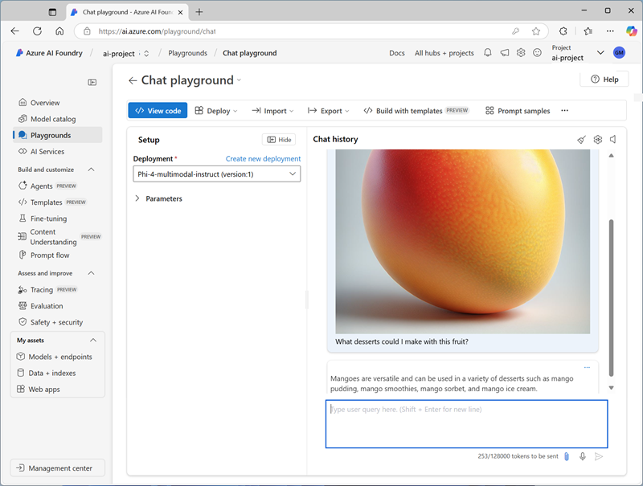
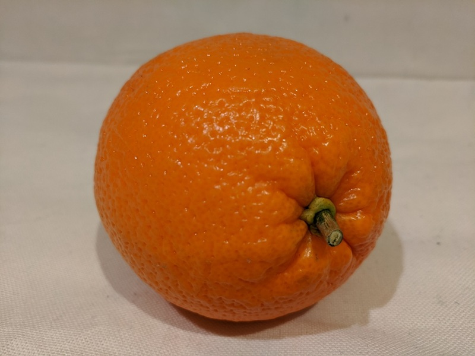

---
lab:
  title: 開發具備視覺功能的聊天應用程式
  description: 使用 Azure AI Foundry 來建置支援影像輸入的生成式 AI 應用程式。
---

# 開發具備視覺功能的聊天應用程式

在此練習中，您會使用 *Phi-4-multimodal-instruct* 產生式 AI 模型，來產生對包含影像之提示的回應。 您將開發一個應用程式，透過使用 Azure AI Foundry 和 Azure AI 模型推斷服務，為雜貨店中的新鮮產品提供 AI 協助。

> **注意**：本練習是以發行前 SDK 軟體為基礎，可能會有所變更。 如有必要，我們會使用特定版本的套件，這可能無法反映最新的可用版本。 您可能會遇到一些非預期行為、警告或錯誤。

雖然本練習是以 Azure AI Foundry Python SDK 為基礎，您仍可使用多種特定語言 SDK 來開發 AI 聊天，包括：

- [適用於 Python 的 Azure AI 專案](https://pypi.org/project/azure-ai-projects)
- [適用於 Microsoft .NET 的 Azure AI 專案](https://www.nuget.org/packages/Azure.AI.Projects)
- [適用於 JavaScript 的 Azure AI 專案](https://www.npmjs.com/package/@azure/ai-projects)

本練習大約需要 **30** 分鐘的時間。

## 開啟 Azure AI Foundry 入口網站

讓我們從登入 Azure AI Foundry 入口網站開始。

1. 在網頁瀏覽器中，開啟 [Azure AI Foundry 入口網站](https://ai.azure.com) 於`https://ai.azure.com` 並使用您的 Azure 認證登入。 關閉首次登入時開啟的所有提示或快速啟動窗格，如有必要，使用左上角的 **Azure AI Foundry** 標誌瀏覽到首頁，首頁類似於下圖（若 [說明]**** 窗格已開啟，請將其關閉）：

    

1. 檢閱首頁上的資訊。

## 選擇模型以開始專案

Azure AI *專案* 提供 AI 開發的共同作業工作區。 讓我們從選擇想要使用的模型開始，並建立一個專案以運用該模型。

> **注意**：AI Foundry 專案可以以 *Azure AI Foundry* 資源為基礎，提供存取 AI 模型 (包括 Azure OpenAI)、Azure AI 服務和其他資源，以開發 AI 代理程式和聊天解決方案。 或者，專案可以以 *AI 中心*資源為基礎，其中包括與 Azure 資源的連線，以取得安全儲存體、計算和特殊化工具。 Azure AI Foundry 型專案非常適合想要管理 AI 代理程式或聊天應用程式開發資源的開發人員。 AI 中心型專案更適合用於處理複雜 AI 解決方案的企業開發團隊。

1. 在首頁的 [探索模型和功能]**** 區段中搜尋 `Phi-4-multimodal-instruct` 模型。我們會在專案中使用這個模型。

1. 在搜尋結果中選取 **Phi-4-multimodal-instruct** 模型以查看其詳細資料，然後在該模型的頁面頂端選取 [使用此模型]****。

1. 當系統提示您建立專案時，請輸入您專案的有效名稱，然後展開 [進階選項]****。

1. 選取**自訂**，然後為您的中樞指定下列設定：
    - **Azure AI Foundry 資源**：*Azure AI Foundry 資源的有效名稱*
    - **訂用帳戶**：您的 Azure 訂用帳戶**
    - **資源群組**：建立或選取資源群組**
    - **區域**：*選取任何 **建議的 AI Foundry***\*

    > \*部分 Azure AI 資源受區域模型配額限制。 在練習後期，若超過配額限制，您可能需要在不同區域建立另一個資源。

1. 選取 [建立]****，並等待您的專案建立完成，這包括您選取的 Phi-4-multimodal-instruct 模型部署。

    > 注意：視您選取的模型而定，您可能會在專案建立過程中收到其他提示。 同意條款並完成部署。

1. 建立專案後，您的模型會顯示在 [模型 + 端點]**** 頁面中：

    

## 在遊樂場中測試模型。

現在您可以在聊天遊樂場中使用影像型提示測試您的多模式模型部署。

1. 在模型部署頁面上，選取 [在遊樂場中開啟]****。

1. 在新的瀏覽器索引標籤中，從 `https://github.com/MicrosoftLearning/mslearn-ai-vision/raw/refs/heads/main/Labfiles/gen-ai-vision/mango.jpeg`下載 [mango.jpeg](https://github.com/MicrosoftLearning/mslearn-ai-vision/raw/refs/heads/main/Labfiles/gen-ai-vision/mango.jpeg)，並將其儲存至本機檔案系統上的資料夾。

1. 在聊天遊樂場頁面上的 **[設定]** 窗格中，確定已選取 **Phi-4-multimodal-instruct** 模型部署。

1. 在主要聊天工作階段面板的聊天輸入方塊底下，使用 [附加] 按鈕 (**&#128206;**) 上傳 *mango.jpeg* 影像檔，然後新增文字 `What desserts could I make with this fruit?`並提交提示。

    

1. 檢閱回應，希望為您可以使用芒果製作甜點提供相關指導。

## 建立用戶端應用程式

現在您已部署模型，您可以在用戶端應用程式中使用部署。

### 準備應用程式組態

1. 在 Azure AI Foundry 入口網站中，檢視專案的**概觀**頁面。

1. 在 [端點和金鑰]**** 區域中，確認已選取 **Azure AI Foundry** 程式庫，並記下 **Azure AI Foundry 專案端點**。 您將使用此連接字串連線到用戶端應用程式中的專案。

1. 開啟一個新的瀏覽器索引標籤（保持 Azure AI Foundry 入口網站在現有索引標籤中開啟）。 然後在新索引標籤中，瀏覽到 `https://portal.azure.com` 的 [Azure 入口網站](https://portal.azure.com)；如果出現提示，請使用您的 Azure 認證登入。

    關閉任何歡迎通知，以查看 Azure 入口網站 首頁。

1. 使用頁面頂部搜尋欄右側的 **[\>_]** 按鈕在 Azure 入口網站中建立一個新的 Cloud Shell，並選擇 ***PowerShell 環境*** (訂用帳戶中沒有儲存體)。

    Cloud Shell 會在 Azure 入口網站底部的窗格顯示命令列介面。 您可以調整或最大化此窗格的大小，以便更輕鬆地使用。

    > **注意**：如果您之前建立了使用 *Bash* 環境的 Cloud Shell，請將其切換到 ***PowerShell***。

    > **注意**：若入口網站要求您選取儲存體來保存檔案，請選擇 [不需要儲存體帳戶]****，然後選取您正在使用的訂閱，然後按 [套用]****。

1. 在 Cloud Shell 工具列中，在**設定**功能表中，選擇**轉到經典版本**（這是使用程式碼編輯器所必需的）。

    **<font color="red">繼續之前，請先確定您已切換成 Cloud Shell 傳統版本。</font>**

1. 請在 Cloud Shell 窗格中，輸入下列命令，以便複製包含練習程式碼檔案的 GitHub 存放庫（輸入 [命令]，或將它複製到剪貼簿，然後在命令列上點選滑鼠右鍵，再貼上純文字即可）：

    ```
    rm -r mslearn-ai-vision -f
    git clone https://github.com/MicrosoftLearning/mslearn-ai-vision
    ```

    > **提示**：當您將命令貼到 Cloud Shell 中時，輸出可能會佔用大量的螢幕緩衝區。 您可以透過輸入 `cls` 命令來清除螢幕，以便更輕鬆地專注於每個工作。

1. 複製存放庫之後，瀏覽至包含應用程式碼檔案的資料夾：  

    ```
   cd mslearn-ai-vision/Labfiles/gen-ai-vision/python
    ```

1. 在 Cloud Shell 命令列窗格中，輸入下列命令來安裝您將使用的程式庫：

    ```
   python -m venv labenv
   ./labenv/bin/Activate.ps1
   pip install -r requirements.txt azure-identity azure-ai-projects openai
    ```

1. 輸入以下命令，編輯已提供的設定檔：

    ```
   code .env
    ```

    程式碼編輯器中會開啟檔案。

1. 在程式碼檔案中，將 **your_project_endpoint** 預留位置取代為 Foundry 專案端點 (從 Azure AI Foundry 入口網站中的專案 **概觀** 頁面複製)，並將 **your_model_deployment** 預留位置取代為您指派給 Phi-4-multimodal-instruct 模型部署的名稱。

1. 取代預留位置後，在程式碼編輯器中使用 **CTRL+S** 命令或 **按下滑鼠右鍵 > [儲存]** 來儲存變更，然後使用 **CTRL+Q** 命令或 **按下滑鼠右鍵 > [結束]** 來關閉程式碼編輯器，同時保持 Cloud Shell 命令列開啟。

### 撰寫程式碼以連線至您的專案，並與模型聊天

> **提示**：新增程式碼時，請確保保持正確的縮排。

1. 輸入以下命令，編輯已提供的\程式碼檔案：

    ```
   code chat-app.py
    ```

1. 在程式碼檔案中，記下檔案頂端新增的現有語句，以匯入必要的 SDK 命名空間。 然後，在註解 **[新增參考]** 下，新增以下程式碼來參考您先前安裝之程式庫中的命名空間：

    ```python
   # Add references
   from azure.identity import DefaultAzureCredential
   from azure.ai.projects import AIProjectClient
   from openai import AzureOpenAI
    ```

1. 在 **main** 函式中，在註解 [取得組態設定]**** 下，請注意程式碼會載入您在設定檔中定義的專案連接字串和模型部署名稱值。
1. 在 **main** 函式中，在註解 [取得組態設定]**** 下，請注意程式碼會載入您在設定檔中定義的專案連接字串和模型部署名稱值。
1. 尋找 **Initialize the project client** 註解，並新增下列程式碼以連線至您的 Azure AI Foundry 專案：

    > **秘訣**：請小心維持程式碼的正確縮排層級。

    ```python
   # Initialize the project client
   project_client = AIProjectClient(            
            credential=DefaultAzureCredential(
                exclude_environment_credential=True,
                exclude_managed_identity_credential=True
            ),
            endpoint=project_endpoint,
        )
    ```

1. 找到 **Get a chat client** 註解，新增下列程式碼以建立用戶端物件來與模型聊天：

    ```python
   # Get a chat client
   openai_client = project_client.get_openai_client(api_version="2024-10-21")
    ```

### 撰寫程式碼以提交 URL 型影像提示

1. 請注意，程式碼包含迴圈，可讓使用者輸入提示，直到他們輸入 "quit" 為止。 然後在迴圈區段中，尋找註解 **[取得影像輸入的回應]**，新增下列程式代碼以提交包含下列影像的提示：

    

    ```python
   # Get a response to image input
   image_url = "https://github.com/MicrosoftLearning/mslearn-ai-vision/raw/refs/heads/main/Labfiles/gen-ai-vision/orange.jpeg"
   image_format = "jpeg"
   request = Request(image_url, headers={"User-Agent": "Mozilla/5.0"})
   image_data = base64.b64encode(urlopen(request).read()).decode("utf-8")
   data_url = f"data:image/{image_format};base64,{image_data}"

   response = openai_client.chat.completions.create(
        model=model_deployment,
        messages=[
            {"role": "system", "content": system_message},
            { "role": "user", "content": [  
                { "type": "text", "text": prompt},
                { "type": "image_url", "image_url": {"url": data_url}}
            ] } 
        ]
   )
   print(response.choices[0].message.content)
    ```

1. **使用 CTRL+S** 命令將變更儲存至程式碼檔案 - 但尚未關閉。

## 登入 Azure，然後執行應用程式

1. 在 Cloud Shell 命令行窗格中，輸入下列命令以登錄 Azure。

    ```
   az login
    ```

    **<font color="red">即使 Cloud Shell 工作階段已經過驗證，您還是必須登錄 Azure。</font>**

    > **注意**：在大部分情況下，只要使用 *az 登入*即可。 不過，如果您在多個租用戶中擁有訂用帳戶，您可能需要使用 *--tenant* 參數指定租用戶。 如需詳細資料，請參閱[使用 Azure CLI 以互動方式登入 Azure](https://learn.microsoft.com/cli/azure/authenticate-azure-cli-interactively)。
    
1. 出現提示時，請遵循指示，在新的索引標籤中開啟登入頁面，然後輸入所提供的驗證碼和您的 Azure 認證。 接著，在命令行中完成登入流程。如果出現提示，請選取包含 Azure AI Foundry 中樞的訂用帳戶。

1. 登入之後，請輸入下列命令以執行應用程式：

    ```
   python chat-app.py
    ```

1. 當系統提示時，輸入下列提示：

    ```
   Suggest some recipes that include this fruit
    ```

1. 檢閱回應。 然後輸入 `quit`以結束程式。

### 修改程式碼以上傳本機圖像檔

1. 在應用程式程式代碼的程式代碼編輯器中，於 [迴圈] 區段中，尋找您先前在註解 [取得影像輸入的回應]**** 下新增的程式碼。 然後修改程式碼，如下所示，以上傳此本機圖像檔：

    

    ```python
   # Get a response to image input
   script_dir = Path(__file__).parent  # Get the directory of the script
   image_path = script_dir / 'mystery-fruit.jpeg'
   mime_type = "image/jpeg"

   # Read and encode the image file
   with open(image_path, "rb") as image_file:
        base64_encoded_data = base64.b64encode(image_file.read()).decode('utf-8')

   # Include the image file data in the prompt
   data_url = f"data:{mime_type};base64,{base64_encoded_data}"
   response = openai_client.chat.completions.create(
            model=model_deployment,
            messages=[
                {"role": "system", "content": system_message},
                { "role": "user", "content": [  
                    { "type": "text", "text": prompt},
                    { "type": "image_url", "image_url": {"url": data_url}}
                ] } 
            ]
   )
   print(response.choices[0].message.content)
    ```

1. **使用 CTRL+S** 命令，將您的變更儲存至程式代碼檔案。 您也可以視需要關閉程式代碼編輯器 （**CTRL+Q**）。

1. 在 Cloud Shell 命令列窗格中，輸入下列命令來執行應用程式：

    ```
   python chat-app.py
    ```

1. 當系統提示時，輸入下列提示：

    ```
   What is this fruit? What recipes could I use it in?
    ```

15. 檢閱回應。 然後輸入 `quit`以結束程式。

    > **注意**：在這個簡單的應用程式中，我們還沒有實現保留交談記錄的邏輯；因此模型會將每個提示視為一個新要求，而沒有前一個提示的上下文。

## 清理

若您已完成探索 Azure AI Foundry 入口網站，您應該刪除在本練習中建立的資源，以避免產生不必要的 Azure 成本。

1. 開啟 [Azure 入口網站](https://portal.azure.com)，並檢視您部署本練習中所使用資源的資源群組內容。
1. 在工具列上，選取 [刪除資源群組]****。
1. 輸入資源群組名稱並確認您想要將其刪除。
